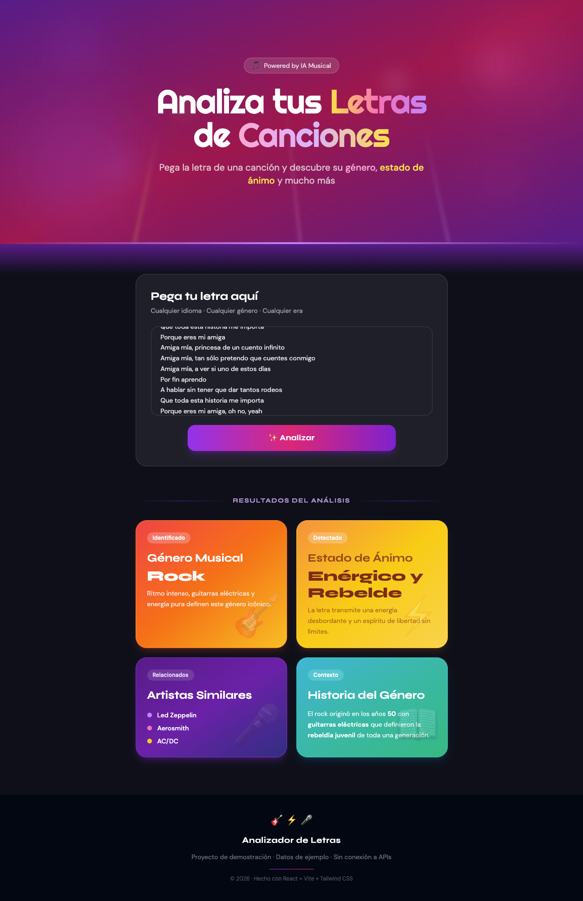

# 🎵 Analizador de Letras de Canciones

## Vista previa




Página web estática que analiza letras de canciones y muestra
género musical, estado de ánimo, artistas similares e historia
del género.

## Tecnologías
- React 18
- Vite
- Tailwind CSS
- Google Fonts (Righteous + DM Sans)

## Cómo ejecutar localmente
```bash
npm install
npm run dev
```

## Cómo construir para producción
```bash
npm run build
npm run preview
```

## Estructura del proyecto
```
src/
├── components/
│   ├── Hero.jsx
│   ├── Analizador.jsx
│   ├── ResultadoCard.jsx
│   └── Footer.jsx
├── data/
│   └── mockResults.js
└── App.jsx
```

## Características
- Diseño responsive (mobile, tablet, desktop)
- Dark mode por defecto
- Datos de demostración hardcodeados (sin conexión a APIs)
- Animaciones CSS en tarjetas de resultados

## Uso de GitHub Copilot
Este proyecto fue desarrollado con asistencia de GitHub Copilot
para generación de componentes React, configuración de Tailwind
CSS y diseño responsive.

---
Tarea 2 — GitHub Copilot · Instituto Tecnológico de Orizaba
AI-103 Introduction · 2026
